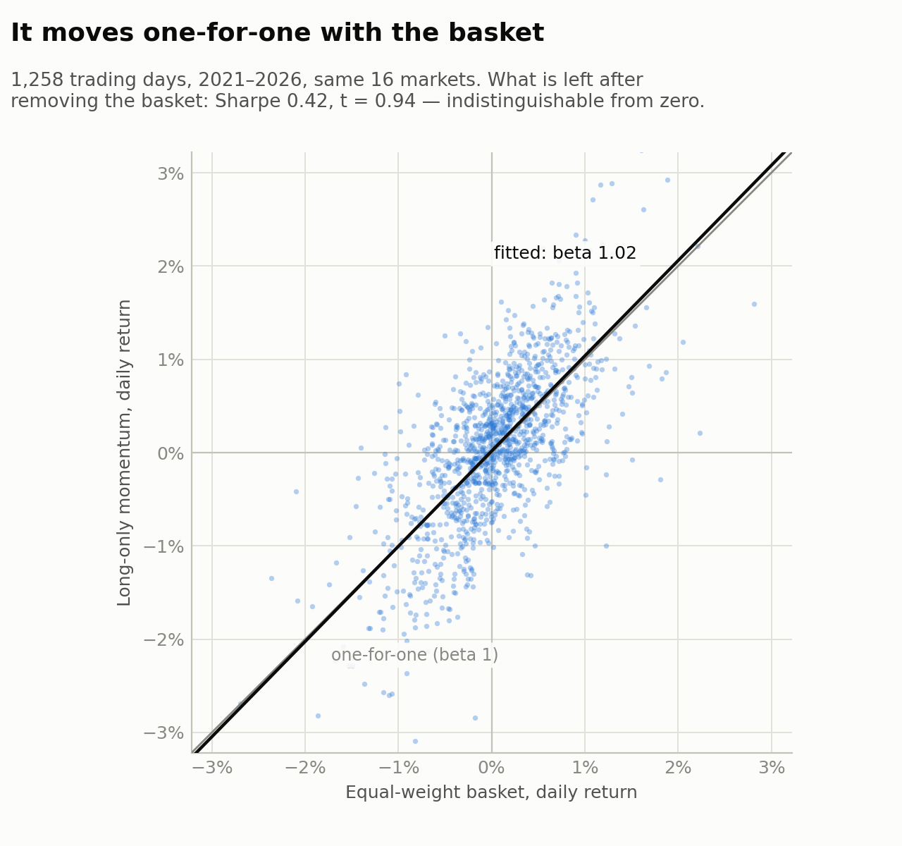
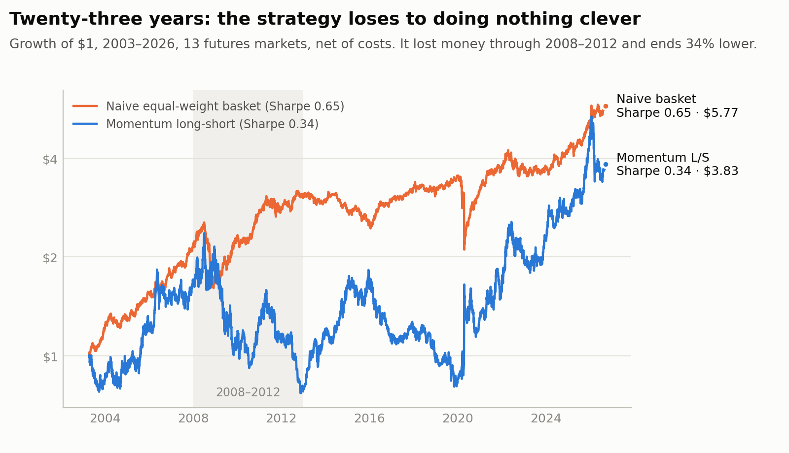
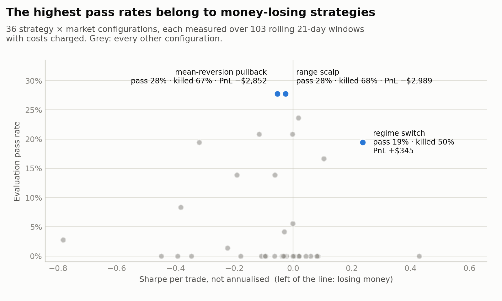

# What the audit found

*How a platform built to find a trading edge ended up proving it had none — and the
engineering decisions that made that possible to see.*

---

## The thesis

I set out to test a specific idea. Retail proprietary-trading firms sell evaluations: pay a
fee, trade a simulated account under strict rules, and if you hit a profit target without
breaching a drawdown limit you are "funded" and share in profits. Each evaluation looks
like a cheap option — the loss is capped at the fee, the upside is a stream of payouts.

The bet was not on alpha. It was on the thing large multi-strategy funds say their edge
actually is: **risk management and capital allocation**. Buy many options, size each one
to the rules, spread correlation across a fleet, and let the allocation layer do the work
the signal cannot.

I spent six months building that seriously. An event-driven backtester with `Decimal`
money throughout. A risk engine modelling each firm's drawdown rules to the cent. A
measurement layer that reuses the *live* risk engine — the same guard, kill switch and
position sizer that would trade real money — so that "what the tests prove" is "what
production runs". Walk-forward with purging, overfitting probabilities, reality checks on
the search. Hundreds of tests.

Then I ran an adversarial audit on all of it: five parallel reviews (the quantitative
evidence, the industry economics, execution realism, the architecture, and whether to
rewrite the hot path in Rust), plus an independent out-of-sample retest on a second data
vendor.

It did not go well for the thesis. It went quite well for the engineering.

---

## Finding 1 — the one edge was a bug

The project had exactly one result that looked real: a cross-sectional momentum book
across sixteen futures and FX markets. Long the strongest twelve-month performers, short
the weakest. Sharpe **0.99**, held out of sample at **1.12**. It was the thing the rest
of the plan was going to stand on.

The weights were built like this:

```python
weights = weights.replace(0.0, np.nan).ffill().fillna(0.0)
```

The intent was to carry each rebalance's target forward to the days between rebalances.
What it actually did was treat *every intended zero* as missing — so a market dropped at a
rebalance inherited its previous position instead of going flat. **The book never
exited.** It was meant to hold six markets and held ten. Gross exposure was meant to sit
at 2.0 and drifted to 3.3.

Two independent reviewers found it. The fix is to forward-fill whole *rows*, since only
rebalance rows carry a target. Sharpe: 0.99 → **0.94**. The out-of-sample 1.12 was the
bug.

A second, quieter one sat next to it: maximum drawdown was computed on `cumsum()` of
returns rather than on a compounded equity curve. Every drawdown the project had ever
printed for that book was wrong.

## Finding 2 — measured on prices nobody could have traded

The daily series were raw continuous-futures exports with no roll handling at all. The
volume profile made it obvious in hindsight: each file was one contract's own quote
history, with a median daily volume of zero for the first two years. A third of the rows
were padding bars with no range. Returns were computed straight across holes of 158 to
207 days, so one crude-oil "day" booked **+24.76%**. And a `volume > 0` filter silently
deleted the entire FX sleeve, because the FX vendor reports volume as −1 when it does not
have it — the panel advertised as sixteen markets was thirteen.

A 250-day momentum ranker selects on exactly this kind of smooth, non-tradeable drift.
Rebuilt on clean, independently sourced data with all sixteen markets: **0.64**.

## Finding 3 — and what was left was beta

This was the decisive test, and the one I should have run first. Regress the strategy's
daily returns on a naive equal-weight basket of the same markets, over the days the
strategy is actually in the market:

<picture>
  <source media="(prefers-color-scheme: dark)" srcset="figures/fig-beta-dark.png">
  
</picture>

| same 1,258 days | Sharpe | ann. vol | max DD |
|---|---|---|---|
| long-only momentum | 0.89 | 14.0% | 18.5% |
| naive equal-weight basket | 0.84 | 9.8% | 13.5% |

The long-only book had a **beta of 1.02** to the basket: it moved one-for-one with it.
What was left after removing that had a Sharpe of 0.42 with **t = 0.94** — a 95%
interval from −0.50 to +1.33, indistinguishable from zero, and that is before deflating
for the configurations searched to find it. On Sharpe the two were a tie. The basket got
there with 30% less volatility, a smaller drawdown, and no model to be wrong.

Extending the sample to 23 years on a second vendor settled the "favourable regime"
caveat that had sat in the notes for months:

<picture>
  <source media="(prefers-color-scheme: dark)" srcset="figures/fig-24y-growth-dark.png">
  
</picture>

Sharpe **0.34** for the strategy against **0.65** for the basket, with the strategy
losing money right through 2008–2012 and ending a third lower.

**A correction to my own first version of this finding.** The numbers above are not the
ones I first published. My first regression ran over the whole sample, including the 250
days at the start in which the strategy held nothing *by construction* — it needs a year
of history to form its first book. Its return on those days was zero while the basket
moved, and that biased everything against the strategy: it pulled the beta down to 0.86,
diluted the strategy's Sharpe, and credited the basket with a year the strategy was not
allowed to trade. I reported that the basket *beat* the strategy, 1.07 to 0.76. On the
days the strategy could actually trade, it is a tie. The conclusion — that there is no
alpha — survived; that particular claim did not. I found it while drawing the chart
above, when the figure disagreed with the text.

The forward paper test that was supposed to be the decisive evidence had been abandoned
after two runs. Its cron job called `python`, which did not exist in a non-interactive
shell on that machine, and the "command not found" was piped into a `grep` filter and
discarded. The log looked merely quiet. The one book it did log lost **10.97%** in 21
trading days while the basket lost 1.33%.

## Finding 4 — the headline numbers were frictionless and rule-free

The engine had two paths. The backtester charged costs and produced Sharpe and profit
factor. A separate real-engine path produced every pass rate, kill rate and expected value
the project published — and it built its paper broker with the zero-cost defaults. The
two numbers sat side by side on every dashboard and were never comparable.

Separately, one firm's configuration forbade holding positions overnight, but the flat
logic only fired when a clock time was configured, and that firm never set one. Half of
the trades on one market were held overnight on a firm that would have closed them.

Charging real costs and enforcing the rule structurally, at the session roll:

| | published | corrected |
|---|---|---|
| strategy A, market 1 | 31.1% | **17.5%** |
| strategy A, market 2 | 30.1% | **15.5%** |
| strategy B, market 1 | 27.2% | **20.4%** |

## Finding 5 — the search had been searching a third of the space

There were two live strategy registries and they disagreed: one had 31 entries, an older
one had 13, and the parameter optimiser resolved through the older one. It could reach
**10 of 32** strategies, and none of those added in the last three months. Every "we
searched that family and found nothing" had been drawn over a much smaller space than it
read as.

After unifying the registry — 28 strategies now searchable, with the four that cannot be
swept by a short window saying so explicitly rather than vanishing — I re-ran everything
through the corrected engine: 18 families, 2 markets, 3 firms, 108 measured rows.

- **0 of 108** reached the pass-rate threshold a viable evaluation needs.
- **1 of 108** had positive expected value: **+$4**, on a fee of about $150.

The old conclusions had been drawn on too small a space with mechanics that were too kind,
and they were right anyway. That is the useful outcome.

## Finding 6 — a pass rate measures variance as readily as edge

The re-search produced the result I find most instructive. Ranked by the rate at which a
strategy passed an evaluation, the top of the table was made of **money-losing
strategies**:

<picture>
  <source media="(prefers-color-scheme: dark)" srcset="figures/fig-pass-rate-dark.png">
  
</picture>

| strategy | pass rate | killed | Sharpe | PnL |
|---|---|---|---|---|
| mean-reversion pullback | **27.8%** | **66.7%** | −0.05 | −$2,852 |
| range scalp | **27.8%** | **68.1%** | −0.03 | −$2,989 |
| regime switch | 19.4% | 50.0% | **0.24** | **+$345** |

The only strategy with a real Sharpe passed less often than the two that lost the most.

Once stated the mechanism is not subtle. A high-activity, near-zero-expectancy strategy is
a random walk taking many steps. Over 21 days it has a respectable chance of touching the
profit target before the loss limit — and a larger chance of touching the loss limit
first. A pass rate is not a measure of skill. It must never be read without the kill rate
and the PnL on the same line.

## Why the thesis could not have worked anyway

Aggregated data across 300,000 evaluation accounts from one of the largest prop-firm
technology vendors, reported by Finance Magnates: about **14%** pass, and about **7%** of
all buyers ever receive a payout. The industry's economics run on fees from the other
93%. Risk management redistributes outcomes *within* that pool; it does not change the
pool. My own engine, by a completely independent route, measured every configuration at
roughly minus one fee.

---

## What I would tell someone building one of these

**Make the measurement engine the production engine.** The most valuable decision in the
project was that the pass-rate harness ran the same guard, kill switch and sizer that
would trade live. It is why the audit's findings were findings rather than arguments.
It is also why the one place that broke the rule — a second broker construction with
different cost defaults — is exactly where the worst numbers came from.

**Two implementations of anything will disagree.** Two strategy registries. Seven Sharpe
calculations under three conventions. Four drawdown routines. Costs in one engine and not
the other. Every one of those was a place where a published number was wrong, and not one
of them was visible from inside either copy.

**Regress on the naive benchmark first.** Not last, not as a robustness check — first.
Everything in findings 1 through 3 would have been caught in an afternoon by asking what
equal-weighting the universe would have done.

**Compare on the window where the strategy can trade.** Any strategy that needs history
before it can act has a warm-up period in which its return is zero by construction.
Leave those days in and every comparison is biased against it — the benchmark gets
credit for a period the strategy was not allowed to play. I made exactly this mistake
in the first published version of finding 3, and it survived until a chart disagreed
with the prose.

**Name your conventions.** "Sharpe" meant three different things across this codebase, so
figures in its own notes were not comparable with each other. Annualising a strategy that
trades 82 days a year by √252 inflated one headline from about 3.5 to 6.1.

**Test the thing that is hard to test.** The kill switch race was real and a normal
concurrency test could not see it — zero detections in 800 attempts. The fix was not a
better race; it was a test that widened the window deliberately while leaving production
code untouched.

**Refuse rather than lie.** Wherever a function could return a plausible-looking number
from invalid input — a drawdown fraction against a near-zero peak, a pass rate measured
with no costs — the better design was to raise, or to label the result, not to serve it.

**Write your negatives down.** The audit was only possible because the project had kept,
in plain markdown, every result it had ever measured — including the embarrassing ones.
A negative result you did not record is one you will pay to rediscover.

---

## What survived

The risk kernel and the measurement library in this repository. They are not an edge.
They are the part of the platform that, when pointed at its own author's best idea, said
no — and was right.

The engineering also survived the question of whether to rewrite it in Rust. Profiling
showed the natural candidate — the drawdown guard — was 3 to 13% of runtime, so infinite
speed there was worth at most 1.15× end to end. The real costs were algorithmic: an
indicator rescanning 96 bars on every bar, and 103 independent evaluation windows run
sequentially on a 22-core machine. Fixing those in Python took the main workload from 9.5
seconds to 1.3, **bit-identical**, verified by hashing every output across one to
twenty-two workers. A second implementation of the risk rules, in another language, would
have reintroduced exactly the kind of disagreement that finding 5 was about.
